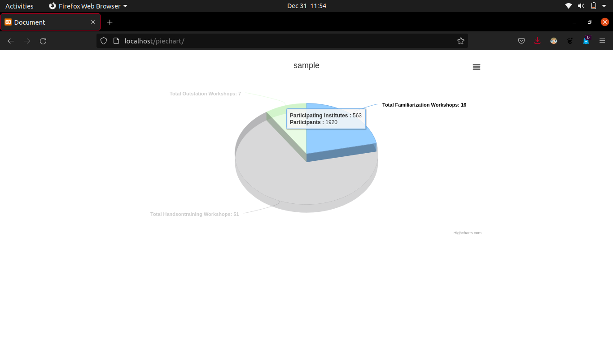

# Plotting Piechart using Highchart API

This repository is about making a javascript function for plotting piechart with just 2 parameters title & data

I created this at my time during Internship, to be added to the IITB INUP website as an additional functionality. 

## Here is a working sample of the above....

